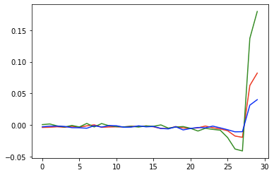
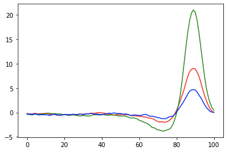

## STA calculation methods for GPU

### Method 1: Temporal resampling of the white noise stimulus movie

Temporal resampling allows the user to set an arbitrary frequency F (120 Hz, 240 Hz, 102 Hz, anything really) and 
bins both spikes and frames into bins of width 1/F, and calculates STAs with an effective frequency of F. 
This frequency is measured relative to the 20 kHz sample rate of the array, so it is more robust than estimating
the timing from the TTL channel (for the traditional Vision method of calculating STAs, where spikes are binned into
the stimulus frames, the length of each bin varies a little bit based on the temporal jitter of the monitor refresh rate,
whereas here the bin widths are constant).

Temporal resampling also enables us to supersample the stimulus movie. For example, even if the stimulus refreshes at 120 Hz,
we can calculate an STA at a higher frequency (i.e. 240 Hz) by resampling the stimulus at the higher frequency. In effect,
this allows us to incorporate information about when within a frame a given cell spiked (the intuitive hypothesis here is that knowing
whether a cell spiked at the beginning, in the middle, or at the end of a frame interval contains additional information about
the timecourse).

Note that even if we set the resampling frequency at some integer multiple of the monitor refresh rate, the resampled bin
intervals will eventually go out-of-sync with the monitor refresh intervals, because of temporal jitter in the frame rate
from the monitor.

Approximate runtime: about 4-8 minutes for 30 minute white noise stimulus. Stixel size doesn't appear to strongly affect
the runtime.

Saves HDF5 output.

Requires numpy, pytorch >= 1.4, usual Python infrastructure stuff. Runs on GPU.

#### Synopsis

```shell script
python bin_frames_by_spike_times.py <analysis-path> <ds-name> <path-to-stimulus-xml> <path-to-save-output-pickle> [flags]
```
#### Options
* **-r**, **--frame-rate**, resampling frequency, the frequency to calculate the STAs at. Default value 120.0 
* **-n**, **--n-frames**, STA depth, default value 51
* **-b**, **--batch**, number of cells per batch. Default 512. Larger runs faster, too large and GPU runs out of space
* **-j**, **--jitter**, use the jittered stimulus (jitter stimulus formula defined by the frame generator, same as what Colleen used in the SM cell paper)
* **-s**, **--superbatch** number of cells per superbatch, useful for the case where the dimensionality of the stimulus is so large that the STAs for every cell cannot be stored on GPU simultaneously. Default not used.
* **-l**, **--list** Optional text file to specify cell IDs to compute STAs for. Useful to speed up calculation if only interested in a small subset of the cells

#### Example command

```shell script
CUDA_VISIBLE_DEVICES=3, python bin_frames_by_spike_times.py /Volumes/Lab/Users/ericwu/yass-reconstruction/2017-12-04-5/data001 data001 /Volumes/Analysis/stimuli/white-noise-xml/RGB-10-4-0.48-11111.xml /Volumes/Scratch/Users/wueric/debug/2017_12_04_5_data001_example -r 240 -n 51
```

#### Example results

Example timecourses. Same cell for both. ON midget, RGB-10-4 stimulus at 120 Hz

Note that the X-axes are different, and the labels are in samples, so they can't
quite be compared one-to-one!

The Vision timecourse:



The supersampled timecourse (supersampled at 240 Hz):



### Method 2: Binning spikes into frame intervals (similar to traditional STA calculation method)

In this case, the algorithm uses time bins defined by interpolating between the TTLs as the STA bins. This implicitly assumes
that the frame rate is stable, since it assumes that each frame is shown for exactly the same amount of time. This uses the 
same overlap-interval algorithm that Method 1 uses, just with a different clocking scheme.

Saves HDF5 output.

#### Synopsis

```shell script
python bin_spikes_by_frame_times.py <analysis-path> <ds-name> <path-to-stimulus-xml> <path-to-save-output-pickle> [flags]
```
#### Options
* **-n**, **--n-frames**, STA depth, default value 51
* **-b**, **--batch**, number of cells per batch. Default 512. Larger runs faster, too large and GPU runs out of space
* **-j**, **--jitter**, use the jittered stimulus (jitter stimulus formula defined by the frame generator, same as what Colleen used in the SM cell paper)
* **-l**, **--list** Optional text file to specify cell IDs to compute STAs for. Useful to speed up calculation if only interested in a small subset of the cells
